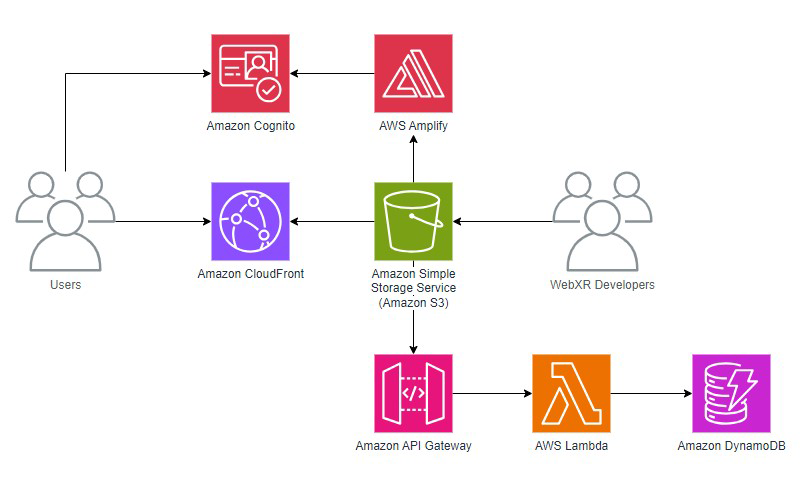
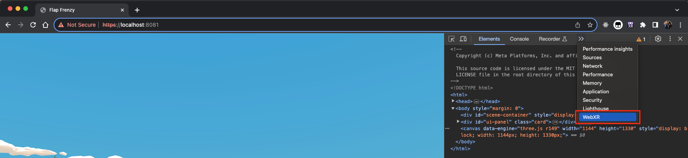

# Empower Your WebXR App Using AWS Serverless Services

This repository contains an example solution on how to enhance your WebXR applications using AWS Serverless Services, providing scalable, efficient, and seamless user experiences.

**Note**: _The sample code and related technology provided under the AWS Customer Agreement are intended for non-production use. Test, secure, and optimize them for production as per your standards. Deploying this content may incur AWS charges._

## Key Features

- Lambda and API Gateway for backend API support.
- Cognito and Amplify SDK for authentication and authorization.
- S3, Lambda, and API Gateway for cloud-based asset rendering.
- Automated project deployment using CDK.

## Contents

- **A Web Project**: Under `web` folder is a sample WebXR game integrated with AWS. This WebXR game was developed by [Felix Zhang](https://github.com/felixtrz) from Meta, and we worked on making it integrated with AWS with Felix and Meta's consent. You can find Felix's WebXR source code [here](https://github.com/felixtrz/flap-frenzy). 

- **An Infra Project**: CDK code for deploying AWS services used in the Web Project.

- **Lambda Scripts Folder**: Contains code for Lambda functions, located under "infra/lambdaScripts".

## Architecture Diagram



## Preliminary Setup

1. **AWS CLI Installation and Configuration**: Install [AWS CLI](https://docs.aws.amazon.com/cli/latest/userguide/cli-chap-install.html), configure it with your preferred region.
2. **AWS CDK CLI Installation**: `npm install -g aws-cdk`. More on [CDK CLI](https://docs.aws.amazon.com/cdk/v2/guide/cli.html).
3. **Web Project Dependencies**: Install [Node.js](https://nodejs.org/en/download), navigate to the `infra` folder, and run `npm install`. Also navigate to the `web` folder, and run `npm install`.

## Deployment with AWS CDK

1. **Deploy Infrastructure**: Go to `web` folder, execute `npm run build`. Then from the `infra` folder, execute `cdk deploy --outputs-file './config.json'`.
2. **Configure and Deploy Web App**: Update `web/src/amplifyconfigure.js` with CDK output values.

## Running the Application

**Local Testing**: Install the [WebXR API Emulator plugin](https://chrome.google.com/webstore/detail/webxr-api-emulator/mjddjgeghkdijejnciaefnkjmkafnnje), run `npm run serve` in the `web/` folder, and navigate to localhost:8081.

Right-click anywhere in the browser window, and select "Inspect" to open Chrome developer tools. 



Open the `WebXR` panel from the top of the developer tools frame. Click the "Enter VR" button to start VR mode and spawn the player. Use the handles of the simulated XR device to interact. Flapping up and down three times will initiate the game. In the `Network` tab of the Chrome developer tools, you can verify if the API call was successful. 


## Build for Production

To create a production build, run `npm run build` in the web folder. This build is ready for uploading to the specified S3 bucket.

## Hosting the game 
You can use either the [AWS management console](#using-the-aws-management-console) or [AWS CLI](#using-the-aws-cli) to push your application files to S3, choose your adventure. 

### Using the AWS management console

Refer to the screenshots below for guidance on how to upload to the S3 bucket.

Open the AWS management console, and navigate to the [Amazon S3 console](https://s3.console.aws.amazon.com/s3/home).

Select your provisioned S3 bucket (bucket name can be found in CDK outputs), and click "Upload". 

Upload every file in the `web/dist` folder (except for /assets, because these were uploaded through CDK deloy) into your S3 bucket.

### Using the AWS CLI

Navigate to the `web/dist` folder in your terminal.

Run the following AWS CLI command (swapping in your S3 bucket) to upload your application code:

```
aws s3 cp . s3://<REPLACE_WITH_S3_BUCKETNAME_FROM_CDK_OUTPUT> --recursive
```

After uploading, open the CloudFront URL (can be found in CDK outputs from the previous CDK deploy step) in a browser to see your game in action. 

## Implementation Overview

The CDK script deploys S3 for asset storage, DynamoDB for leaderboards, Lambda functions for backend logic, Cognito for authentication, API Gateway for API endpoints, and a CloudFront distribution for web hosting.

## License

Licensed under the MIT-0 License. See the LICENSE file for more details.